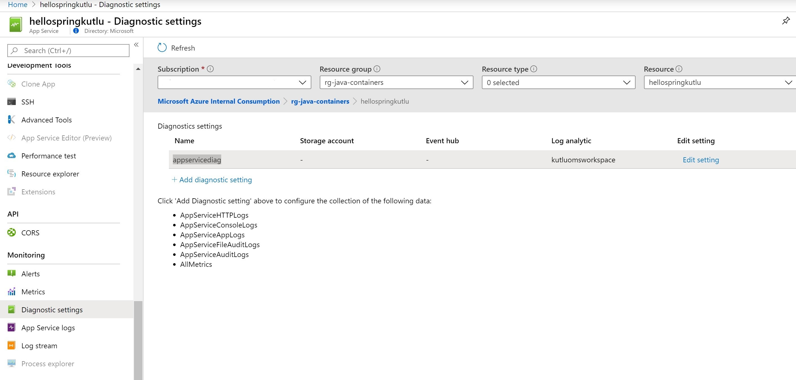
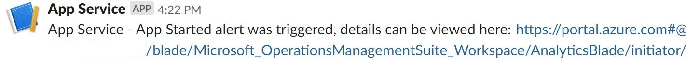

# Send app service logs to slack

1. Pick the app service instance that you want to enable logging.

2. Scroll down to monitoring on the menu left hand side and click on **Diagnostic settings**.

    

3. Click on **add dignostic setting**, in the new window select the *logs* that you want to send to log analytics. For example, *AppServiceConsoleLogs* will send the *standard output or standard error* streams. Check the **send to log analyitcs** checkbox and send the logs to an existing log analytics workspace of your preference. Please refer to this annoucement for the details about the other logs <https://azure.github.io/AppService/2019/11/01/App-Service-Integration-with-Azure-Monitor.html>.


4. It will take some time for initial logs to be send to log analyitcs, as the appropriate log analytics repository schemas are going to initialised. Once the schemas are initilised and the logs are ingested, you should be able to view them in your log analytics workspace.

5. Go to the log analytics workspace you have configured the logs to be sent to, scroll down to *logs*. In the logs window, find the *LogManagement* in the *schemas* listed. Expand *LogManagement* and double click on *AppServiceConsoleLogs*. Make sure that *AppServiceConsleLogs* is selected in the query tab and click on **Run** to retrieve the logs.

    

6. You can expand the logs details by clicking on the expand arrow in the logs panel below. Within the expanded log details, click on 3 dots that appears next to *ResultDescription* *property* and click on *Include* from the pop-up menu.

    

7. Modify the query so that it looks like this:

    ``` KQL
    AppServiceConsoleLogs
    | where ResultDescription contains "Starting Application"
    ```

    

8. Click on **Save** and save your new log analytics query. You can now run this query from the portal, Rest API, PowerShell etc.

    

9. Click on **Create alert rule**, set the *Threshold value* to 0, set the Period to 5 minutes and frequency to 5 minutes.

    

10. Click on **Create action group** and create an action group where we can add our Slack webhook for alerting. Once the action group is created, **Add action group** to add the action group to our *new alert rule* if it is not already added.

    

11. Scroll down in the alert rule creation window, specify the name of the alert and its description.

12. If you want to pass a simple payload to slack that works out of the box, check the *Include custom Json payload for webhook* and enter the following data:

    ``` JSON
    {"text":"#alertrulename alert was triggered, details can be viewed here: #linktosearchresults"}
    ```

    Click on create **Create alert rule** to finialise the alert creation.

    

13. Go ahead and restart your app, this should trigger the new alert rule created and send the alert playload to your slack webhook. It can take up to 5 minutes for log to be detected, as the log search query will be run in 5 minute intervals.

    
